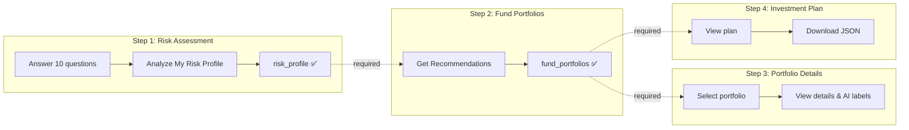
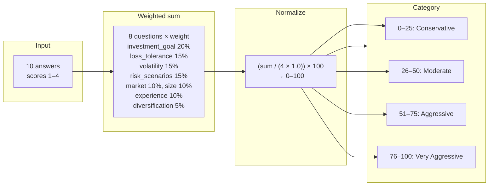
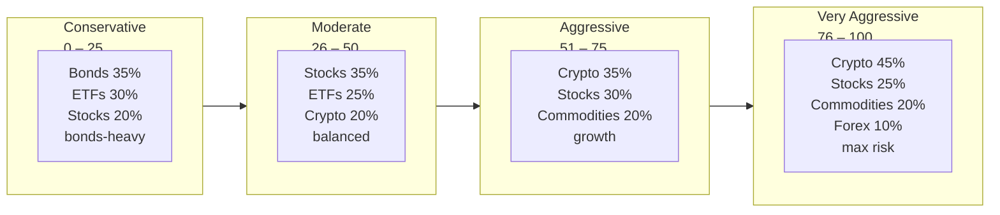
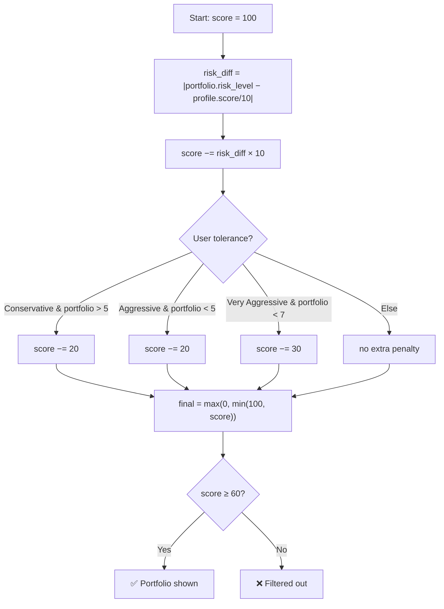
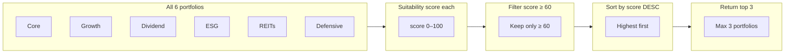

# AI Robo Advisor – Rules (Detailed Specification)

This document specifies **all rules** governing the AI Robo Advisor: validation, scoring, thresholds, formulas, and business logic. Use it as a single source of truth for behavior and implementation.

---

## Table of Contents

0. [Visual Summary of Rules](#0-visual-summary-of-rules) *(diagrams & at-a-glance)*  
1. [Validation & Prerequisite Rules](#1-validation--prerequisite-rules)
2. [Questionnaire Rules](#2-questionnaire-rules)
3. [Scoring Weights Rules](#3-scoring-weights-rules)
4. [Risk Score Calculation Rules](#4-risk-score-calculation-rules)
5. [Risk Tolerance Category Rules](#5-risk-tolerance-category-rules)
6. [Derived Metrics Rules](#6-derived-metrics-rules)
7. [Asset Allocation Rules](#7-asset-allocation-rules)
8. [Risk Factor Identification Rules](#8-risk-factor-identification-rules)
9. [Portfolio Suitability Scoring Rules](#9-portfolio-suitability-scoring-rules)
10. [Portfolio Filtering & Selection Rules](#10-portfolio-filtering--selection-rules)
11. [AI Labeling Rules](#11-ai-labeling-rules)
12. [Stock Allocation Breakdown Rules (UI)](#12-stock-allocation-breakdown-rules-ui)
13. [Investment Plan Rules](#13-investment-plan-rules)
14. [Session & Persistence Rules](#14-session--persistence-rules)

---

## 0. Visual Summary of Rules

This section shows the main rules as **diagrams and visuals** so you can see the flow and numbers at a glance.

---

### 0.1 Step Prerequisites (What Unlocks What)

```
┌─────────────────────────────────────────────────────────────────────────────┐
│  TAB 1: Risk Assessment                                                      │
│  • Answer 10 questions → Click "Analyze My Risk Profile"                     │
│  • Result: risk_profile saved ✅                                             │
└─────────────────────────────────────────────────────────────────────────────┘
                                        │
                                        ▼
┌─────────────────────────────────────────────────────────────────────────────┐
│  TAB 2: Fund Portfolios   (needs: risk_profile)                              │
│  • Click "Get Fund Portfolio Recommendations"                               │
│  • Result: fund_portfolios (up to 3) ✅                                      │
└─────────────────────────────────────────────────────────────────────────────┘
                                        │
                                        ▼
┌─────────────────────────────────────────────────────────────────────────────┐
│  TAB 3: Portfolio Details   (needs: risk_profile + fund_portfolios)           │
│  • Select one portfolio from dropdown → View holdings & AI labels            │
└─────────────────────────────────────────────────────────────────────────────┘

┌─────────────────────────────────────────────────────────────────────────────┐
│  TAB 4: Investment Plan   (needs: risk_profile + fund_portfolios)            │
│  • Plan uses top portfolio (highest suitability) → Download JSON            │
└─────────────────────────────────────────────────────────────────────────────┘
```

**Mermaid – Prerequisite flow:**



---

### 0.2 Risk Score Flow (From Answers to Category)



---

### 0.3 Risk Tolerance Scale (0–100)



| Zone        | Score  | Category        | Typical allocation focus        |
|-------------|--------|-----------------|----------------------------------|
| Low risk    | 0–25   | Conservative    | Bonds 35%, ETFs 30%, Stocks 20% |
| Medium risk | 26–50  | Moderate        | Stocks 35%, ETFs 25%, Crypto 20% |
| High risk   | 51–75  | Aggressive      | Crypto 35%, Stocks 30%, Commodities 20% |
| Very high   | 76–100 | Very Aggressive | Crypto 45%, Stocks 25%, Commodities 20%, Forex 10% |

---

### 0.4 Question Weights (Who Counts for Risk Score)

```
investment_goal         ████████████████████  20%
loss_tolerance          ███████████████       15%
volatility_comfort      ███████████████       15%
risk_scenarios          ███████████████       15%
market_conditions       ██████████            10%
portfolio_size          ██████████            10%
experience_level        ██████████            10%
diversification_pref    █████                   5%
                        ─────────────────────
                        Total = 100%

(Not in score: investment_horizon, liquidity_needs — used for metrics only)
```

---

### 0.5 Suitability Score Flow (Portfolio Match)



**Summary:** Start at 100 → subtract risk-level mismatch (×10) → subtract tolerance mismatch (0, 20, or 30) → clamp 0–100 → show only if **≥ 60**. Return **top 3** portfolios.

---

### 0.6 Portfolio Filtering (Top 3, Threshold 60)



---

### 0.7 Asset Allocation by Risk Category (Overview)

| Asset      | Conservative | Moderate | Aggressive | Very Aggressive |
|-----------|--------------|----------|------------|------------------|
| **Stocks**  | 20%          | 35%      | 30%        | 25%              |
| **ETFs**    | 30%          | 25%      | 10%        | 0%               |
| **Bonds**   | 35%          | 5%       | 0%         | 0%               |
| **Crypto**  | 5%           | 20%      | 35%        | 45%              |
| **Commodities** | 10%     | 15%      | 20%        | 20%              |
| **Forex**   | 0%           | 0%       | 5%         | 10%              |

**Visual (Conservative vs Very Aggressive):**

```
CONSERVATIVE          VERY AGGRESSIVE
Bonds    ███████████  Crypto   █████████████████
ETFs     █████████    Stocks   █████████
Stocks   █████        Commod   █████████
Commod   ███          Forex    ████
Crypto   █
```

---

### 0.8 When Risk Factors Are Added (Warnings)

| If this is true                    | Risk factor message added |
|------------------------------------|---------------------------|
| Portfolio size answer ≤ 2           | "High portfolio concentration risk" |
| Liquidity answer ≤ 2                | "High liquidity needs may limit investment options" |
| Experience answer ≤ 2              | "Limited trading experience" |
| Market conditions answer ≤ 2       | "Tendency to panic sell during downturns" |
| Diversification answer ≤ 2         | "Low diversification preference increases concentration risk" |
| Risk tolerance = Very Aggressive   | "Very high risk tolerance may lead to significant losses" |
| Risk tolerance = Conservative      | "Conservative approach may limit growth potential" |

---

### 0.9 Key Numbers at a Glance

| What                    | Value / Rule |
|-------------------------|--------------|
| Number of questions     | 10           |
| Questions in risk score  | 8            |
| Risk score range         | 0–100        |
| Risk thresholds          | 25, 50, 75   |
| Suitability range        | 0–100        |
| Suitability minimum      | **60** (to show) |
| Max portfolios returned  | **3**        |
| Pre-defined portfolios  | 6            |
| Portfolio risk_level     | 1–10         |
| Answer score per option  | 1–4          |
| Total scoring weight     | 1.0          |

---

## 1. Validation & Prerequisite Rules

| Rule ID | Description | Condition | Effect |
|--------|-------------|-----------|--------|
| V1 | **Analyze Risk Profile** | User must select exactly one option for each of the 10 questions. | If any question unanswered: show error *"Please answer all questions to proceed."* Do not run risk profile generation. |
| V2 | **Fund Portfolio Recommendations (Tab 2)** | `st.session_state.risk_profile` must be set (Step 1 completed). | If not set: show info *"Please complete the risk assessment first."* Button *"Get Fund Portfolio Recommendations"* is still shown but user must complete Step 1 first. |
| V3 | **Portfolio Details (Tab 3)** | Both `risk_profile` and `fund_portfolios` must be set. | If either missing: show info *"Please complete the risk assessment and get portfolio recommendations first."* No portfolio selector shown. |
| V4 | **Investment Plan (Tab 4)** | Both `risk_profile` and `fund_portfolios` must be set. | If either missing: show info *"Please complete all previous steps first."* No plan content shown. |
| V5 | **Portfolio selector (Tab 3)** | At least one recommended portfolio must exist. | Dropdown lists portfolio names from `fund_portfolios`; default index is 0. |
| V6 | **Risk profile save** | Profile is saved only after successful `generate_risk_profile()`. | File name format: `risk_profile_{user_id}_{YYYYMMDD_HHMMSS}.json`. Default `user_id` is `"default"`. |

---

## 2. Questionnaire Rules

| Rule ID | Description |
|--------|-------------|
| Q1 | **Number of questions:** Exactly **10** questions. |
| Q2 | **Question type:** All questions are **single-choice** (radio). Only one option per question may be selected. |
| Q3 | **Answer format:** Each option has a numeric **score** in range **1–4** (1 = most conservative, 4 = most aggressive). |
| Q4 | **Question order (fixed):** 1. investment_goal, 2. investment_horizon, 3. loss_tolerance, 4. experience_level, 5. portfolio_size, 6. volatility_comfort, 7. diversification_preference, 8. liquidity_needs, 9. risk_scenarios, 10. market_conditions. |
| Q5 | **Questions used only for risk score:** Exactly these 8 question IDs contribute to the risk score: `investment_goal`, `loss_tolerance`, `volatility_comfort`, `risk_scenarios`, `market_conditions`, `portfolio_size`, `experience_level`, `diversification_preference`. |
| Q6 | **Questions not used in risk score:** `investment_horizon` and `liquidity_needs` are **not** in `scoring_weights`. They are used only for derived metrics and profile display. |
| Q7 | **Missing answers:** If an answer is missing for a question used in metrics, the code uses a default: `investment_horizon` default 2, `experience_level` default 2, `loss_tolerance` default 2, `volatility_comfort` default 2, `diversification_preference` default 2, `liquidity_needs` default 2, `portfolio_size` default 2, `market_conditions` default 2, `diversification_preference` default 2. |

### Questionnaire Content (Exact Options)

| Question ID | Question Text | Option Scores (1–4) |
|-------------|---------------|----------------------|
| investment_goal | What is your primary investment goal? | Preserve capital=1, Steady growth=2, Aggressive growth=3, Maximum returns=4 |
| investment_horizon | What is your investment time horizon? | &lt;1 year=1, 1–3 years=2, 3–5 years=3, &gt;5 years=4 |
| loss_tolerance | How would you react to a 20% portfolio decline? | Sell everything=1, Sell some=2, Hold=3, Buy more=4 |
| experience_level | How would you describe your trading experience? | New=1, Some experience=2, Experienced=3, Professional=4 |
| portfolio_size | What percentage of your total wealth is this investment? | &gt;50%=1, 25–50%=2, 10–25%=3, &lt;10%=4 |
| volatility_comfort | How comfortable are you with daily price fluctuations? | Very uncomfortable=1, Small changes=2, Moderate=3, Thrive on high=4 |
| diversification_preference | How important is portfolio diversification to you? | Extremely important=4, Important=3, Somewhat=2, Not important=1 |
| liquidity_needs | How quickly might you need to access your funds? | Immediately=1, Few months=2, Within a year=3, Several years=4 |
| risk_scenarios | Which scenario best describes your risk preference? | Guaranteed small=1, Moderate with risk=2, Higher with higher risk=3, Maximum with maximum risk=4 |
| market_conditions | How do you typically react to market downturns? | Panic sell=1, Reduce significantly=2, Hold=3, Buy the dip=4 |

---

## 3. Scoring Weights Rules

| Rule ID | Description |
|--------|-------------|
| W1 | **Total weight:** Sum of all scoring weights must equal **1.0**. |
| W2 | **Weights (fixed):** |

| Question ID | Weight | Percentage |
|-------------|--------|------------|
| investment_goal | 0.20 | 20% |
| loss_tolerance | 0.15 | 15% |
| volatility_comfort | 0.15 | 15% |
| risk_scenarios | 0.15 | 15% |
| market_conditions | 0.10 | 10% |
| portfolio_size | 0.10 | 10% |
| experience_level | 0.10 | 10% |
| diversification_preference | 0.05 | 5% |

| W3 | **Only weighted questions:** `calculate_risk_score()` iterates only over `answers` keys that exist in `scoring_weights`. Other answers are ignored for the score. |

---

## 4. Risk Score Calculation Rules

| Rule ID | Formula / Rule |
|--------|----------------|
| R1 | **Formula:** `total_score = Σ (answer × weight)` over all question IDs in `scoring_weights`. `total_weight = Σ weight` over the same set. |
| R2 | **Normalization:** `normalized_score = (total_score / (4 × total_weight)) × 100`. The divisor `4` is the maximum possible answer value. |
| R3 | **Clamping:** Final risk score = `min(100, max(0, normalized_score))`. Score is always in **[0, 100]**. |
| R4 | **Empty/invalid:** If `total_weight <= 0`, return default score **50.0** (treated as moderate). |
| R5 | **Uniqueness:** Each question contributes at most once (the selected option’s score × that question’s weight). |

---

## 5. Risk Tolerance Category Rules

| Rule ID | Description |
|--------|-------------|
| T1 | **Mapping from score to category (inclusive boundaries):** |

| Score Range | Risk Tolerance Enum |
|-------------|---------------------|
| score ≤ 25 | CONSERVATIVE |
| 25 &lt; score ≤ 50 | MODERATE |
| 50 &lt; score ≤ 75 | AGGRESSIVE |
| score &gt; 75 | VERY_AGGRESSIVE |

| T2 | **Boundaries:** 25, 50, 75 are the exact thresholds. Score 25 → Conservative; 26 → Moderate; 50 → Moderate; 51 → Aggressive; 75 → Aggressive; 76 → Very Aggressive. |

---

## 6. Derived Metrics Rules

### 6.1 Max Drawdown Tolerance

| Rule ID | Formula / Rule |
|--------|----------------|
| D1 | **Base by risk tolerance:** CONSERVATIVE=0.10, MODERATE=0.20, AGGRESSIVE=0.35, VERY_AGGRESSIVE=0.50. |
| D2 | **Formula:** `max_drawdown = base_drawdown[risk_tolerance] × (loss_tolerance_answer / 4)`. `loss_tolerance_answer` is the selected option score (1–4) for question `loss_tolerance`. |
| D3 | **Range:** Result is in (0, base_drawdown], e.g. Conservative: (0, 0.10]. |

### 6.2 Volatility Tolerance

| Rule ID | Formula / Rule |
|--------|----------------|
| D4 | **Formula:** `volatility_tolerance = (volatility_comfort / 4) × 0.5`. `volatility_comfort` is the answer (1–4) for question `volatility_comfort`. |
| D5 | **Range:** Result is in **[0, 0.5]** (0–0.5 scale). |

### 6.3 Diversification Preference

| Rule ID | Formula / Rule |
|--------|----------------|
| D6 | **Formula:** `diversification_preference = diversification_answer / 4`. `diversification_answer` is the score (1–4) for question `diversification_preference`. |
| D7 | **Range:** Result is in **[0.25, 1.0]** (0–1 scale). |

### 6.4 Liquidity Needs

| Rule ID | Formula / Rule |
|--------|----------------|
| D8 | **Formula:** `liquidity_needs = (5 - liquidity_answer) / 4`. `liquidity_answer` is the score (1–4) for question `liquidity_needs`. |
| D9 | **Inversion:** Higher answer = lower liquidity needs. Result: 1→1.0, 2→0.75, 3→0.5, 4→0.25. |
| D10 | **Range:** Result is in **[0.25, 1.0]** (0–1 scale). |

### 6.5 Investment Horizon (Enum)

| Rule ID | Rule |
|--------|------|
| D11 | **Mapping:** `investment_horizon` answer: ≤1 → SHORT_TERM, ≤3 → MEDIUM_TERM, else → LONG_TERM. |

### 6.6 Experience Level (Enum)

| Rule ID | Rule |
|--------|------|
| D12 | **Mapping:** `experience_level` answer: ≤1 → BEGINNER, ≤2 → INTERMEDIATE, ≤3 → ADVANCED, else → EXPERT. |

---

## 7. Asset Allocation Rules

| Rule ID | Description |
|--------|-------------|
| A1 | **Source:** `recommended_asset_allocation` is taken from a fixed table keyed by **risk_tolerance** only (not by score or other answers). |
| A2 | **Allocation table (percentages as decimals, sum = 1.0):** |

| Risk Tolerance | stocks | etfs | bonds | crypto | commodities | forex |
|----------------|--------|------|-------|--------|-------------|-------|
| CONSERVATIVE | 0.20 | 0.30 | 0.35 | 0.05 | 0.10 | (0) |
| MODERATE | 0.35 | 0.25 | 0.05 | 0.20 | 0.15 | (0) |
| AGGRESSIVE | 0.30 | 0.10 | 0 | 0.35 | 0.20 | 0.05 |
| VERY_AGGRESSIVE | 0.25 | 0 | 0 | 0.45 | 0.20 | 0.10 |

| A3 | **Keys in dict:** Keys are lowercase: `stocks`, `etfs`, `bonds`, `crypto`, `commodities`, `forex`. VERY_AGGRESSIVE has no `etfs` or `bonds` key; missing asset classes are implicitly 0. |
| A4 | **Display:** Full portfolio allocation is shown as-is (pie chart + table). Stock allocation breakdown is derived separately (see §12). |

---

## 8. Risk Factor Identification Rules

Risk factors are **appended** to a list; multiple can apply. Each rule below adds **at most one** factor.

| Rule ID | Condition | Risk Factor Text |
|--------|-----------|------------------|
| F1 | `portfolio_size` ≤ 2 | "High portfolio concentration risk" |
| F2 | `liquidity_needs` ≤ 2 (raw answer) | "High liquidity needs may limit investment options" |
| F3 | `experience_level` ≤ 2 | "Limited trading experience" |
| F4 | `market_conditions` ≤ 2 | "Tendency to panic sell during downturns" |
| F5 | `diversification_preference` ≤ 2 | "Low diversification preference increases concentration risk" |
| F6 | risk_tolerance == VERY_AGGRESSIVE | "Very high risk tolerance may lead to significant losses" |
| F7 | risk_tolerance == CONSERVATIVE | "Conservative approach may limit growth potential" |

| F8 | **Order:** Factors are added in the order of the checks above. |
| F9 | **Uniqueness:** Same text is not deduplicated; if logic repeated, the same factor could appear twice (current code adds each at most once). |

---

## 9. Portfolio Suitability Scoring Rules

| Rule ID | Formula / Rule |
|--------|----------------|
| S1 | **Initial score:** `score = 100.0`. |
| S2 | **Risk level difference:** `risk_diff = abs(portfolio.risk_level - profile.score / 10)`. `profile.score` is 0–100; `profile.score / 10` is 0–10. Portfolio `risk_level` is 1–10. |
| S3 | **Penalty from risk diff:** `score -= risk_diff * 10`. So each unit of difference reduces score by 10. |
| S4 | **Additional penalties by user tolerance:** |
| | • If user is **CONSERVATIVE** and `portfolio.risk_level > 5`: `score -= 20`. |
| | • If user is **AGGRESSIVE** and `portfolio.risk_level < 5`: `score -= 20`. |
| | • If user is **VERY_AGGRESSIVE** and `portfolio.risk_level < 7`: `score -= 30`. |
| S5 | **No double penalty:** Each portfolio gets at most one of the S4 penalties (the first matching condition). |
| S6 | **Final clamp:** `suitability_score = max(0, min(100, score))`. |

### Pre-Defined Portfolio Parameters (Fixed)

| Portfolio Name | risk_level | expected_return (%) | expected_volatility (%) | rebalancing_frequency |
|----------------|------------|---------------------|--------------------------|------------------------|
| Core | 5 | 8.5 | 12.0 | Quarterly |
| Growth | 7 | 12.0 | 18.0 | Monthly |
| Dividend | 4 | 6.5 | 10.0 | Quarterly |
| ESG | 5 | 9.0 | 13.0 | Quarterly |
| REITs | 5 | 7.5 | 14.0 | Quarterly |
| Defensive | 3 | 5.5 | 8.0 | Semi-Annually |

---

## 10. Portfolio Filtering & Selection Rules

| Rule ID | Description |
|--------|-------------|
| P1 | **Input:** All 6 pre-defined portfolios; user’s `RiskProfile`. |
| P2 | **Step 1:** For each portfolio, set `portfolio.suitability_score` using `_calculate_suitability(portfolio, profile)`. |
| P3 | **Step 2:** Sort portfolios by `suitability_score` **descending** (highest first). |
| P4 | **Step 3:** Filter: keep only portfolios with `suitability_score >= 60`. |
| P5 | **Step 4:** Return the **top N** of the filtered list, where **N = min(max_portfolios, len(suitable))**. Default `max_portfolios = 3`. |
| P6 | **Possible outcomes:** 0, 1, 2, or 3 portfolios returned. If fewer than 3 have score ≥ 60, only those are returned. |
| P7 | **UI:** When 0 portfolios qualify, show warning *"No suitable portfolios found for your risk profile."* |

---

## 11. AI Labeling Rules

### 11.1 Which Questions Contribute to Risk Score

- Only the 8 question IDs in `scoring_weights` contribute.
- `investment_horizon` and `liquidity_needs` do **not** affect the numeric risk score.

### 11.2 Stocks – Sector Label

| Rule ID | Description |
|--------|-------------|
| L1 | **Input:** `symbol`, `asset_class`. If `asset_class != "Stock"`, skip sector map. |
| L2 | **SECTOR_MAP:** Pre-defined mapping from ticker to sector string (e.g. AAPL→Technology, JNJ→Healthcare). See code for full list. |
| L3 | **Sector → AILabel:** Sector string is mapped to one of: TECHNOLOGY, HEALTHCARE, FINANCIAL, ENERGY, CONSUMER, INDUSTRIAL, MATERIALS, UTILITIES, REAL_ESTATE, COMMUNICATION. Exactly one sector label added per stock if symbol in map. |

### 11.3 ETFs – Theme Labels

| Rule ID | Description |
|--------|-------------|
| L4 | **Input:** `symbol`, `asset_class`. If `asset_class != "ETF"`, skip ETF theme map. |
| L5 | **ETF_THEMES:** Pre-defined mapping from ETF symbol to list of theme strings (e.g. SPY→["US Market", "Large Cap", "Broad Market"]). Each string is mapped to an AILabel; all matching labels are added. |
| L6 | **Theme string → AILabel:** Includes US_MARKET, EMERGING_MARKET, DEVELOPED_MARKET, ASIA_PACIFIC, EUROPE, TECHNOLOGY, HEALTHCARE, etc., GROWTH_STOCK, VALUE_STOCK, DIVIDEND_STOCK, LARGE_CAP, SMALL_CAP, MID_CAP, INCOME_FOCUSED, REAL_ESTATE, DEFENSIVE, CYCLICAL. |

### 11.4 Risk Label by Asset Class

| Rule ID | Description |
|--------|-------------|
| L7 | If `asset_class == "Crypto"`: add **HIGH_RISK**. |
| L8 | Else if `asset_class == "Bond"`: add **LOW_RISK**. |
| L9 | Else (Stock, ETF, etc.): add **MEDIUM_RISK**. |
| L10 | **One risk label per holding:** Exactly one of LOW_RISK, MEDIUM_RISK, HIGH_RISK is added. |

### 11.5 Label Uniqueness

- Same AILabel may appear only once per holding (enforced by enum list; duplicates not added in current logic when mapping from theme strings).

---

## 12. Stock Allocation Breakdown Rules (UI)

These rules apply to the **Stock Allocation Breakdown** section (normalized to 100% of the stock portion).

| Rule ID | Description |
|--------|-------------|
| B1 | **Stock categories:** A category from `recommended_asset_allocation` is treated as “stock” if its **lowercase** key contains any of: `stocks`, `etfs`, `equities`, `stock`. |
| B2 | **Raw stock total:** `total_stock_allocation = sum(percentage)` over all categories that satisfy B1. |
| B3 | **Normalization:** For each such category, `normalized_pct = (raw_percentage / total_stock_allocation) × 100`. So the breakdown sums to 100% of the stock portion. |
| B4 | **Sum check:** If `abs(sum(normalized_pct) - 100) > 0.1`, re-normalize: `pct_i := (pct_i / sum) × 100` so the total is exactly 100 (within rounding). |
| B5 | **When no stock categories:** If no category matches B1 or `total_stock_allocation == 0`, use **default** breakdown by risk_tolerance: |
| | • **CONSERVATIVE:** Large Cap 40%, Dividend 30%, Blue Chip 30%. |
| | • **MODERATE:** Growth 40%, Large Cap 35%, Mid Cap 25%. |
| | • **AGGRESSIVE or VERY_AGGRESSIVE:** Growth 50%, Tech 30%, Small Cap 20%. |
| B6 | **Info text:** If B3 used: show info that “Total Stock Allocation: X% of your portfolio is allocated to stocks” and that the breakdown is normalized to 100%. If B5 used: show “Showing default stock allocation breakdown based on your risk profile.” |

---

## 13. Investment Plan Rules

| Rule ID | Description |
|--------|-------------|
| I1 | **Portfolio used:** The plan uses the **first** portfolio in the list `fund_portfolios` (i.e. the one with the highest suitability score). No user choice on this tab for which portfolio drives the plan. |
| I2 | **Contents:** Plan includes: Plan Overview (profile + recommended portfolio), Portfolio Allocation Summary (holdings table), Implementation Plan (steps 1–3), Risk Management, AI Labels Summary (top 10 by weight), Download button. |
| I3 | **Download:** One JSON file. Filename format: `investment_plan_{YYYYMMDD_HHMMSS}.json`. Contents: user_profile (risk_tolerance, risk_score, investment_horizon, experience_level), recommended_portfolio (name, theme, description, expected_return, expected_volatility, risk_level, suitability_score, rebalancing_frequency), holdings (symbol, name, allocation, asset_class, ai_labels, description), generated_at (ISO timestamp). |
| I4 | **Prerequisite:** Plan is only generated and shown when both `risk_profile` and `fund_portfolios` are set (same as V4). |

---

## 14. Session & Persistence Rules

| Rule ID | Description |
|--------|-------------|
| X1 | **Session state keys:** `risk_profile`, `fund_portfolios`, `selected_portfolio`. All can be None until set. |
| X2 | **risk_profile:** Set only when user clicks “Analyze My Risk Profile” and all 10 answers are present; then overwritten with new profile. Not cleared by switching tabs. |
| X3 | **fund_portfolios:** Set only when user clicks “Get Fund Portfolio Recommendations” in Tab 2; then overwritten with new list (up to 3 portfolios). Not cleared by switching tabs. |
| X4 | **selected_portfolio:** Set when user selects a portfolio from the dropdown in Tab 3; can be any of the portfolios in `fund_portfolios`. |
| X5 | **File save:** Only the risk profile is saved to a JSON file (on Analyze). Investment plan is downloadable on demand (Tab 4) but not auto-saved to server. |
| X6 | **No automatic expiry:** Session state is not cleared by timeout; only by rerun/refresh or new analysis overwriting. |

---

## Summary Table: Key Constants

| Constant | Value |
|----------|--------|
| Number of questions | 10 |
| Questions used in risk score | 8 |
| Risk score range | [0, 100] |
| Risk tolerance thresholds | 25, 50, 75 |
| Suitability score range | [0, 100] |
| Suitability threshold (min to show) | 60 |
| Max portfolios returned | 3 |
| Pre-defined portfolios | 6 (Core, Growth, Dividend, ESG, REITs, Defensive) |
| Portfolio risk_level range | 1–10 |
| Answer score range per question | 1–4 |
| Total scoring weight | 1.0 |
| Stock allocation breakdown tolerance (sum) | 0.1% |

This document is the single reference for all AI Robo Advisor rules. For user flow and logic examples, see `AI_ROBO_ADVISOR_USER_WALKTHROUGH.md` and `AI_ROBO_ADVISOR_LOGIC.md`.
