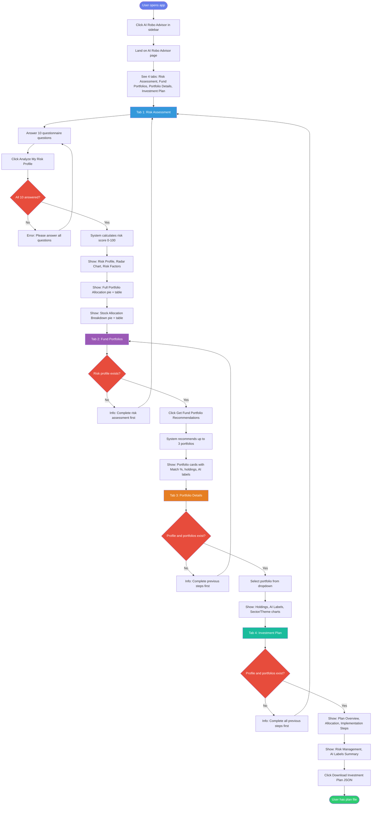

# AI Robo Advisor – User Walkthrough

This document describes the step-by-step user journey through the AI Robo Advisor feature, from entry to downloading an investment plan.

---

## Entry Point

1. **Open the app** and use the sidebar.
2. **Click “AI Robo Advisor”** in the navigation.
3. You land on the **AI Robo Advisor** page with the tagline:  
   *“Get personalized fund portfolio recommendations with AI-labeled investments based on your risk profile.”*
4. You see **four tabs** at the top:
   - **Risk Assessment**
   - **Fund Portfolios**
   - **Portfolio Details**
   - **Investment Plan**

The sidebar shows **About Robo Advisor** (features, how it works, AI labels). After you complete steps, it also shows **Your Current Profile** and **Recommended Portfolios**.

---

## Step 1: Risk Assessment (Tab 1)

### What you see

- **Heading:** “Step 1: Complete Risk Assessment”
- **Section:** “Risk Assessment Questionnaire”  
  *“Please answer the following questions to help us understand your risk preferences and investment goals.”*
- **10 questions**, each with radio-button options. Topics include:
  - Primary investment goal
  - Investment time horizon
  - Reaction to a 20% portfolio decline
  - Comfort with daily price swings
  - Risk vs return preference
  - Reaction to market downturns
  - Share of total wealth in this portfolio
  - Trading/investing experience
  - Importance of diversification
  - Need for quick access to funds

### What you do

1. Read each question and **select one option** per question.
2. When all 10 are answered, click **“Analyze My Risk Profile”** (primary button).
3. If any question is missing, an error asks you to answer all questions.

### What happens next

- A spinner shows: *“Analyzing your risk profile…”*
- Your **risk profile** is computed (score 0–100, category, allocation).
- A success message appears and the profile is saved (e.g. as a JSON file).
- The same tab **scrolls down** to show your results.

### Results shown (same tab, below the button)

- **Your Risk Profile**
  - **Metrics row:** Risk Score (e.g. 66/100), Investment Horizon, Experience Level, Max Drawdown Tolerance.
  - **Risk Tolerance Breakdown:** radar chart (Risk Score, Volatility Tolerance, Diversification Preference, Liquidity Needs).
  - **Risk Factors to Consider:** bullet list (if any).
  - **Recommended Portfolio Allocation**
    - **Full portfolio:** pie chart + table (Stocks, ETFs, Bonds, Crypto, Commodities, Forex).
    - **Stock Allocation Breakdown:** explanation that it’s “normalized to 100% of stock portion,” then pie chart + table for the stock slice only.

You can stay on this tab to review everything, then move to **Fund Portfolios**.

---

## Step 2: Fund Portfolios (Tab 2)

### What you see

- **Heading:** “Step 2: Fund Portfolio Recommendations”
- Short description: *“Get recommended fund portfolios that match your risk profile. Each portfolio includes AI-labeled investments.”*

**If you have not done Step 1:**

- An info message: *“Please complete the risk assessment first.”*
- No recommendations until Step 1 is done.

**If you have completed Step 1:**

- A primary button: **“Get Fund Portfolio Recommendations”**.

### What you do

1. Ensure **Step 1 is completed** (risk profile exists).
2. Click **“Get Fund Portfolio Recommendations”**.

### What happens next

- Spinner: *“Analyzing portfolios for your profile…”*
- The system scores 6 predefined portfolios (Core, Growth, Dividend, ESG, REITs, Defensive) against your risk profile and picks up to **3** (suitability score ≥ 60).
- Success message: e.g. *“Found 3 suitable portfolio(s) for your risk profile!”*
- Recommendations appear on the same tab.

### Results shown

- **Recommended Fund Portfolios**  
  *“These are diversified portfolios designed to match your risk profile.”*
- **Portfolio Overview:** high-level summary of the recommended portfolios.
- **Portfolio Details:** for each portfolio, an expandable section:
  - **Name** and **Match %** (suitability score).
  - Description, rebalancing frequency, expected return, volatility, risk level.
  - **Portfolio Holdings:** table (Symbol, Name, Asset Class, Allocation %, AI Labels).
  - **Allocation Breakdown:** pie chart of holdings.
  - **AI Labels Analysis:** how the portfolio is tagged (sectors, themes, geography, risk, style).

You can expand/collapse each portfolio. Your choices here are used in **Portfolio Details** and **Investment Plan**. Next, open **Portfolio Details** to drill into one portfolio.

---

## Step 3: Portfolio Details & AI Labels (Tab 3)

### What you see

- **Heading:** “Step 3: Portfolio Details & AI Labels”

**If Step 1 or Step 2 is missing:**

- Info: *“Please complete the risk assessment and get portfolio recommendations first.”*

**If both are done:**

- A **dropdown:** “Select Portfolio to View Details” with the names of your recommended portfolios (from Step 2).
- After you pick one, the rest of the tab shows that portfolio in detail.

### What you do

1. Select one portfolio from **“Select Portfolio to View Details”**.
2. Scroll through the detailed view.

### What you see (for the selected portfolio)

- **Portfolio name – Detailed Analysis**
- **Holdings with AI Labels:** each holding in an expander:
  - Symbol, name, allocation %
  - Description, asset class
  - **AI Labels:** Sectors, Themes, Geography, Risk Level, Style (each as a small label/tag)
- **Portfolio Composition by AI Labels**
  - **Sector Allocation:** bar chart (e.g. Technology, Healthcare, Financials, …).
  - **Theme Allocation:** bar chart (e.g. Growth, Dividend, ESG, Defensive, …).

This tab is for deep-dive into one chosen portfolio and its AI labels. When ready, go to **Investment Plan** for the final summary and download.

---

## Step 4: Investment Plan (Tab 4)

### What you see

- **Heading:** “Step 4: Your Personalized Investment Plan”

**If Step 1 or Step 2 is not done:**

- Info: *“Please complete all previous steps first.”*

**If both are done:**

- The plan is generated from your **risk profile** and your **top recommended portfolio** (first of the list from Step 2).

### What you see (plan content)

- **Your Personalized Investment Plan**
- **Plan Overview**
  - Your profile: Risk Tolerance, Investment Horizon, Experience Level, Risk Score.
  - Recommended portfolio: Name, Expected Return, Volatility, Risk Level, Match Score.
- **Portfolio Allocation Summary:** table of holdings (Symbol, Name, Type, Allocation %, AI Labels).
- **Implementation Plan**
  - Step 1: Initial Investment (start with recommended portfolio, allocation, dollar-cost averaging).
  - Step 2: Rebalancing (frequency, when to rebalance).
  - Step 3: Monitoring (review period, when to adjust).
- **Risk Management:** portfolio risk level, expected volatility, diversification, AI label coverage, recommendations.
- **AI Labels Summary:** “Top 10 AI Labels in Your Portfolio” table (label, weight %).
- **Download Your Investment Plan:** button **“Download Investment Plan (JSON)”**.

### What you do

1. Read the plan and implementation steps.
2. Optionally click **“Download Investment Plan (JSON)”** to save the plan (profile, portfolio, holdings, AI labels, timestamp) as a JSON file.

After that, you can revisit any tab (e.g. change portfolio in Tab 3 or re-run recommendations in Tab 2) or leave the AI Robo Advisor via the sidebar.

---

## User Walkthrough Diagram (Mermaid)

The following flowchart summarizes the AI Robo Advisor user journey from the user’s perspective.

---

## Summary: Order of Steps

| Step | Tab | User action | Outcome |
|------|-----|-------------|--------|
| 1 | Risk Assessment | Answer 10 questions → **Analyze My Risk Profile** | Risk score, category, recommended allocation, full + stock breakdown |
| 2 | Fund Portfolios | **Get Fund Portfolio Recommendations** | Up to 3 portfolios with suitability %, holdings, AI labels |
| 3 | Portfolio Details | **Select portfolio** from dropdown | One portfolio’s holdings, AI labels, sector/theme charts |
| 4 | Investment Plan | Read plan → optional **Download (JSON)** | Personalized plan and optional file download |

Prerequisites: Step 2 requires Step 1; Steps 3 and 4 require both Step 1 and Step 2. The sidebar always reflects the current profile and recommended portfolios once they exist.
