# Multi-Asset Trading Platform with AI Robo Advisor 🌍📈🤖

A comprehensive multi-asset trading simulation application built with Streamlit, featuring live market data, portfolio management, interactive trading interface, and an AI-powered robo advisor for personalized fund portfolio recommendations across stocks, bonds, commodities, forex, crypto, and other investment assets.

## Features

### 📊 Market Overview

The Market Overview section provides comprehensive real-time market data, analysis, and insights across four main tabs:

#### 📈 Markets Tab
- **🌍 Global Markets Overview**: 
  - Interactive world map with color-coded market performance by region
  - Real-time data refresh controls with last updated timestamps
  - Regional market breakdown (US, Europe, Asia, Global)
  
- **🌍 Global Market Indices - Interactive World Map**:
  - Visual representation of market performance across different countries
  - Color-coded indicators (green for gains, red for losses)
  - Click to view detailed market information by region
  
- **📊 Overview of Assets**:
  - **Asset Type Selector**: Filter by World Indices, Stocks, Commodities, Currencies, Bonds, Crypto, or view All Assets
  - **World Indices**: Real-time data for major global indices (S&P 500, NASDAQ, Dow Jones, FTSE 100, DAX, CAC 40, Nikkei 225, Hang Seng, Shanghai Composite, etc.) with sparkline charts showing price trends
  - **Stocks**: Real-time prices, changes, and percentage changes for major stocks (Apple, Microsoft, Google, Amazon, Tesla, JPMorgan, etc.) with sparkline charts
  - **Commodities**: Gold, silver, oil, natural gas prices with real-time updates
  - **Currencies**: Major forex pairs (EUR/USD, GBP/USD, USD/JPY, etc.) with exchange rates
  - **Bonds**: US Treasury bond yields (10-year, 2-year, etc.)
  - **Cryptocurrencies**: Bitcoin, Ethereum, and other major cryptocurrencies with real-time prices and sparkline charts
  
- **🏆 Top Performers & Losers**:
  - Top gainers across all asset classes
  - Top losers across all asset classes
  - Quick view of best and worst performing assets
  
- **🌡️ Global Market Heatmap**:
  - Visual heatmap showing relative performance across different markets and asset classes
  
- **📊 Market Summary**:
  - Overall market statistics and trends
  - Summary metrics across different asset classes

#### 📅 Economic Events Tab
- **📅 Economic Events Calendar**:
  - 90-day view of upcoming economic events and indicators
  - Events organized by date with importance indicators
  - Includes:
    - Central bank meetings and announcements
    - Economic data releases (GDP, inflation, employment, etc.)
    - Earnings announcements
    - Government policy announcements
    - International economic events
  - Filter by importance level (High, Medium, Low)
  - Events displayed with date, time, description, and impact level

#### 📰 News Tab
- **📰 Financial News**:
  - Real-time financial news aggregated from major sources:
    - Reuters
    - CNBC
    - Bloomberg
    - MarketWatch
    - Yahoo Finance
    - Investing.com
  - **Search Functionality**: Search news articles by keywords
  - **Source Filtering**: Filter news by specific source
  - **Pagination**: Navigate through multiple pages of articles (up to 100 articles)
  - **Article Cards**: Each article displays:
    - Title with clickable hyperlinks to original articles
    - Source and publication date
    - Summary/description
    - Relative time display (e.g., "2 hours ago")
  - **Deduplication**: Automatically removes duplicate articles
  - **Metrics**: Shows total articles found and current page information
  - **Working Links**: All article links are verified and functional

#### 📊 Market Analysis Tab
- **📈 Key Market Indicators**:
  - **VIX (Volatility Index)**: CBOE Volatility Index measuring market fear (Higher = More Fear)
    - Status indicators: Real-time, Calculated, or Estimated
    - Color-coded volatility levels (High/Normal/Low)
  - **Market Breadth**: Percentage of advancing vs declining stocks
    - Bullish/Bearish indicators
  - **Advance/Decline Ratio**: Ratio of advancing to declining stocks
    - Positive/Negative market sentiment indicators
  - **DXY (US Dollar Index)**: Strength of US dollar against major currencies
  
- **💰 Bond & Yield Analysis**:
  - **10-Year Treasury Yield**: Long-term bond yield
  - **2-Year Treasury Yield**: Short-term bond yield
  - **Yield Curve Analysis**: Comparison of short-term vs long-term yields
    - Normal, Inverted, or Flat yield curve indicators
    - Color-coded status (green for normal, red for inverted)
  
- **😨😊 Fear & Greed Index**:
  - Market sentiment indicator (0-100 scale)
  - Categories: Extreme Fear, Fear, Neutral, Greed, Extreme Greed
  - Color-coded visualization
  - Real-time data from CNN Fear & Greed Index
  
- **🏭 Sector Performance**:
  - Real-time performance data for major sectors:
    - Technology
    - Healthcare
    - Financial
    - Energy
    - Consumer Discretionary
    - Consumer Staples
    - Industrial
    - Materials
    - Utilities
    - Real Estate
  - Percentage change for each sector
  - Visual charts showing sector performance
  - Success rate indicator showing how many sectors were successfully fetched

- **Data Status Legend**:
  - 🟢 **Real-time**: Data fetched directly from API
  - 🟡 **Calculated**: Derived from real market data
  - ⚪ **Estimated**: Approximate value when API is unavailable

### 🌍 Trading Platform
- **Multi-Asset Support**: Trade stocks, bonds, commodities, forex, crypto, REITs, ETFs, and indices
- **Real-time Market Data**: Live prices via Yahoo Finance for all asset classes
- **Trading Simulation**: Place buy/sell orders with realistic trading fees for each asset class
- **Portfolio Management**: Track positions, P&L, and portfolio performance across all asset classes
- **Interactive Charts**: 
  - Standard candlestick charts with historical price data
  - TradingView embedded widgets for professional charting
- **Order Management**: Market and limit orders with order history
- **Performance Analytics**: Real-time portfolio metrics including total value, cash balance, P&L, and P&L percentage

### 🎯 AI Robo Advisor
- **Risk Assessment**: Comprehensive 10-question questionnaire to evaluate your risk preferences, investment goals, time horizon, and financial situation
- **Personalized Risk Profile**: Get your risk score (0-100) and risk tolerance category (Conservative, Moderate, Aggressive, Very Aggressive)
- **Fund Portfolio Recommendations**: Pre-defined fund portfolios matched to your risk profile:
  - **Core Portfolio**: Balanced, diversified mix
  - **Growth Portfolio**: Tech and growth companies
  - **Dividend Portfolio**: Income-focused investments
  - **ESG Portfolio**: Sustainable investing
  - **REITs Portfolio**: Real estate exposure
  - **Defensive Portfolio**: Low-risk, capital preservation
- **AI Labeling**: Automatic labeling of investments with:
  - Sectors (Technology, Healthcare, Financial, Energy, etc.)
  - Themes (Growth Stock, Value Stock, Dividend Stock, Blue Chip)
  - Geography (US Market, Emerging Market, Developed Market, Asia Pacific, Europe)
  - Risk Level (Low, Medium, High)
  - Style (ESG Compliant, Sustainable, Income Focused, Defensive)
- **Portfolio Details**: View holdings with real-time price data, allocation charts, and AI label breakdowns
- **Investment Plans**: Complete personalized investment plans with implementation guidance
- **Portfolio Allocation**: 
  - Full portfolio allocation across asset classes
  - Detailed stock allocation breakdown (normalized to 100%)
- **Export Functionality**: Download your risk profile and investment plan as JSON

## Supported Assets

### Trading Platform Assets
- **📈 Stocks**: Apple, Microsoft, Google, Amazon, Tesla, JPMorgan, and 50+ more
- **🏦 Bonds**: Treasury bonds, corporate bonds, high-yield bonds
- **🥇 Commodities**: Gold, silver, oil, natural gas, agriculture
- **💱 Forex**: EUR/USD, GBP/USD, USD/JPY, and major currency pairs
- **₿ Cryptocurrencies**: Bitcoin, Ethereum, Binance Coin, and 10+ more
- **🏢 REITs**: Real estate investment trusts and REIT ETFs
- **📊 ETFs**: S&P 500, NASDAQ, sector ETFs, and index funds
- **📈 Indices**: S&P 500, Dow Jones, NASDAQ, VIX

### Market Overview Coverage
- **🇺🇸 US Markets**: S&P 500, NASDAQ, Dow Jones, Russell 2000
- **🇪🇺 European Markets**: FTSE 100, DAX, CAC 40, Euro Stoxx 50
- **🇦🇸 Asian Markets**: Nikkei 225, Hang Seng, Shanghai Composite, Taiwan Weighted
- **🌍 Global Markets**: MSCI World, Emerging Markets, South American indices (Brazil, Argentina, Chile)

## Installation

1. Clone the repository:
```bash
git clone <your-repo-url>
cd GithubProj
```

2. Install dependencies:
```bash
pip install -r requirements.txt
```

3. Run the application:
```bash
streamlit run app.py
```

The app will open in your browser at `http://localhost:8501`

## Usage

### Starting the App
1. Run `streamlit run app.py` in your terminal
2. The app will open in your browser at `http://localhost:8501`
3. Navigate between pages using the sidebar navigation

### Using the Market Overview
1. Navigate to the "📊 Market Overview" tab in the sidebar
2. **Markets Tab**:
   - View the interactive world map showing global market performance by region
   - Use the refresh button to update real-time data
   - Select different asset types (World Indices, Stocks, Commodities, Currencies, Bonds, Crypto, or All Assets)
   - Browse through different regions and view detailed market data with sparkline charts
   - Check Top Performers & Losers to see best and worst performing assets
   - View the global market heatmap for visual performance comparison
   - Review market summary statistics
3. **Economic Events Tab**:
   - Browse the 90-day economic events calendar
   - Filter events by importance level (High, Medium, Low)
   - View upcoming central bank meetings, economic data releases, earnings announcements, and policy updates
   - See event details including date, time, description, and impact level
4. **News Tab**:
   - Browse real-time financial news from major sources (Reuters, CNBC, Bloomberg, MarketWatch, Yahoo Finance, Investing.com)
   - Use the search bar to find articles by keywords
   - Filter news by specific source using the source selector
   - Navigate through multiple pages of articles using pagination controls
   - Click on article titles to read full articles on original websites
   - View article summaries, publication dates, and relative timestamps
5. **Market Analysis Tab**:
   - **Key Market Indicators**: 
     - Check VIX (Volatility Index) with status indicators and volatility levels
     - View Market Breadth and Advance/Decline Ratio for market sentiment
     - Monitor DXY (US Dollar Index) strength
   - **Bond & Yield Analysis**:
     - Review 10-year and 2-year Treasury yields
     - Analyze yield curve (Normal, Inverted, or Flat)
   - **Fear & Greed Index**:
     - View current market sentiment (0-100 scale)
     - See category (Extreme Fear, Fear, Neutral, Greed, Extreme Greed)
   - **Sector Performance**:
     - Review real-time performance for all major sectors (Technology, Healthcare, Financial, Energy, etc.)
     - View percentage changes and visual charts
   - Check data status indicators (🟢 Real-time, 🟡 Calculated, ⚪ Estimated) to understand data sources

### Using the Trading Platform
1. Navigate to the "🌍 Trading Platform" tab in the sidebar
2. **Select Asset Class**: Choose from stocks, bonds, commodities, forex, crypto, REITs, ETFs, or indices
3. **Choose Symbols**: Select specific symbols to trade from the available list
4. **View Market Data**: 
   - See real-time prices and market information
   - View interactive charts (standard or TradingView widgets)
   - Select different time periods for historical data
5. **Place Orders**: 
   - Select Buy or Sell
   - Choose Market or Limit order type
   - Enter quantity
   - For limit orders, set your desired price
6. **Monitor Portfolio**: 
   - View total portfolio value, cash balance, and P&L
   - Check all open positions with unrealized P&L
   - Review trade history and order history

### Using the AI Robo Advisor
1. Navigate to the "🎯 AI Robo Advisor" tab in the sidebar
2. **Complete Risk Assessment**: 
   - Answer 10 questions about your investment goals, time horizon, risk tolerance, and financial situation
   - Questions cover: investment goals, time horizon, loss tolerance, investment experience, income stability, liquidity needs, financial knowledge, investment preferences, and risk attitude
3. **Review Risk Profile**: 
   - See your calculated risk score (0-100)
   - View your risk tolerance category
   - Check recommended asset allocation across stocks, bonds, cash, and other assets
   - View detailed stock allocation breakdown
4. **Get Fund Portfolio Recommendations**: 
   - Review up to 3 recommended fund portfolios matched to your risk profile
   - Each portfolio shows suitability score, risk level, expected return, and volatility
   - View portfolio themes and rebalancing frequency
5. **Explore Portfolio Details**: 
   - View all holdings with real-time prices
   - See allocation charts and AI label breakdowns
   - Understand sectors, themes, geography, and risk characteristics
6. **Review Investment Plan**: 
   - Get personalized investment plan with implementation steps
   - View portfolio summary and recommendations
7. **Export Data**: Download your risk profile and investment plan as JSON

## Technical Details

### Architecture
- **Frontend**: Streamlit for interactive web interface
- **Data Sources**: 
  - Yahoo Finance (yfinance) for stocks, ETFs, indices, and market data
  - Fear & Greed Index API for market sentiment
  - RSS feeds for financial news (Reuters, CNBC, Bloomberg, MarketWatch, Yahoo Finance, Investing.com)
- **Backend**: Python with pandas for data processing
- **Charts**: Plotly for interactive visualizations (maps, charts, sparklines)
- **TradingView**: Embedded TradingView widgets for professional charting

### Key Components
- `app.py`: Main Streamlit application with navigation and routing
- `market_overview_page.py`: Market overview, economic events, news, and market analysis
- `unified_trading_platform.py`: Multi-asset trading interface
- `robo_advisor_page.py`: AI robo advisor interface
- `trading_engine.py`: Portfolio and order management system
- `multi_asset_portfolio.py`: Multi-asset portfolio management
- `multi_asset_data_provider.py`: Data fetching for all asset classes
- `multi_asset_config.py`: Asset configuration and definitions
- `fund_portfolio_manager.py`: Fund-based portfolio management with AI labeling
- `risk_assessment_engine.py`: Risk profiling and questionnaire system
- `tradingview_widget.py`: TradingView chart integration
- `config.py`: Configuration settings

### Data Flow
1. Market data fetched from Yahoo Finance (yfinance) for stocks, ETFs, indices, and other assets
2. News articles fetched from RSS feeds of major financial websites
3. Real-time price data flows to trading engine and market overview
4. Streamlit UI updates automatically with new data
5. User interactions trigger portfolio updates and recommendations
6. Risk assessment results are used to match fund portfolios

## Configuration

Edit `config.py` to customize:
- Initial balance (default: $100,000)
- Trading fees (varies by asset class)
- Supported assets and symbols
- Page title and icon

## Dependencies

Key Python packages:
- `streamlit`: Web application framework
- `yfinance`: Yahoo Finance data
- `pandas`: Data processing
- `plotly`: Interactive visualizations
- `fear-and-greed`: Fear & Greed Index
- `feedparser`: RSS feed parsing
- `python-dateutil`: Date parsing utilities

See `requirements.txt` for complete list.

## Troubleshooting

### Common Issues
1. **No price data**: Check internet connection and Yahoo Finance API status
2. **Market data not loading**: Try refreshing the page or check API rate limits
3. **Orders not executing**: Ensure sufficient balance for buy orders or sufficient position for sell orders
4. **Fear & Greed Index showing 0**: This is a fallback value; the system will retry fetching real data
5. **News not loading**: Check internet connection and RSS feed availability

### Performance Tips
- The app auto-refreshes for real-time updates
- Large portfolios may take longer to load
- Close unused browser tabs to improve performance
- News articles are cached to reduce API calls

## User Design Flow

The application follows a clear user flow with three main sections. See `USER_FLOW.md` for detailed Mermaid flowcharts.

### Simplified Flow

```mermaid
flowchart LR
    Start([🚀 Start]) --> Nav{🧭 Navigation}
    Nav -->|📊| MO[Market Overview<br/>4 Tabs]
    Nav -->|🌍| TP[Trading Platform<br/>3 Tabs]
    Nav -->|🎯| RA[AI Robo Advisor<br/>4 Tabs]
    
    MO --> MO1[📈 Markets]
    MO --> MO2[📅 Economic Events]
    MO --> MO3[📰 News]
    MO --> MO4[📊 Market Analysis]
    
    TP --> TP1[💼 Portfolio]
    TP --> TP2[📈 Charts]
    TP --> TP3[🔄 Trading]
    
    RA --> RA1[🎯 Risk Assessment]
    RA --> RA2[💼 Fund Portfolios]
    RA --> RA3[📊 Portfolio Details]
    RA --> RA4[📋 Investment Plan]
```



For the complete detailed flowchart with all user interactions, decision points, and feature flows, see `USER_FLOW.md`.

## System Diagrams

For comprehensive system documentation, see:
- **USER_FLOW.md**: Complete user interaction flowcharts
- **SYSTEM_DIAGRAMS.md**: System architecture, data flow, process flows, and component interactions
- **AI_ROBO_ADVISOR_LOGIC.md**: Detailed explanation of AI Robo Advisor algorithms, risk assessment, and portfolio matching logic

## Project Structure

```
GithubProj/
├── app.py                          # Main application entry point
├── config.py                       # Configuration settings
├── market_overview_page.py         # Market overview and analysis
├── unified_trading_platform.py     # Multi-asset trading interface
├── robo_advisor_page.py            # AI robo advisor interface
├── trading_engine.py                # Portfolio and order management
├── multi_asset_portfolio.py        # Multi-asset portfolio management
├── multi_asset_data_provider.py    # Data fetching for all assets
├── multi_asset_config.py           # Asset configuration
├── fund_portfolio_manager.py       # Fund portfolio management
├── risk_assessment_engine.py       # Risk profiling system
├── tradingview_widget.py            # TradingView integration
├── requirements.txt                # Python dependencies
├── README.md                       # This file
├── USER_FLOW.md                    # Detailed user flow charts
├── SYSTEM_DIAGRAMS.md              # System architecture and process flows
└── AI_ROBO_ADVISOR_LOGIC.md        # AI Robo Advisor logic and algorithms
```

## License

This project is for educational purposes only.

## Disclaimer

This is a simulation application for educational purposes only. It does not involve real money or actual trading. Always do your own research before making any real investment decisions.
