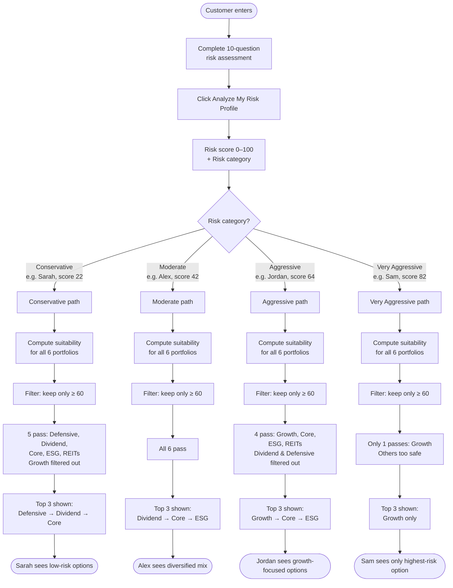
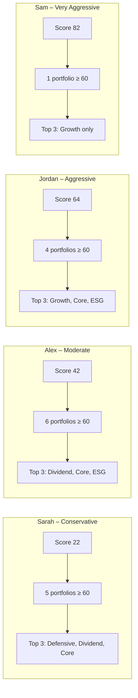

# Robo-Advisor: Customer Scenarios & Filter Outcomes

Concrete **customer scenarios** showing how the **filter** (similarity ≥ 60, top 3) behaves for different risk profiles. Use this to make “scenario of customer” convincing in your meeting (#2).

---

## How the Filter Works (Reminder)

1. **Similarity** = suitability score (0–100) between customer risk profile and each portfolio.
2. **Filter:** Keep only portfolios with suitability **≥ 60**.
3. **Sort** by suitability descending.
4. **Return top 3** (or fewer if fewer pass).

---

## Four Customer Personas

| Persona | Role | Risk attitude | Typical goal |
|--------|------|----------------|--------------|
| **Sarah** | Conservative | Preserve capital, low volatility | Near retirement, bonds-heavy |
| **Alex** | Moderate | Balanced growth, some risk | Mid-career, diversified |
| **Jordan** | Aggressive | Growth, higher risk | Young, equity/crypto |
| **Sam** | Very Aggressive | Maximum return, high risk | Long horizon, max risk |

---

## Customer Scenario Flowchart

The diagram below shows how **different customer types** flow through the robo-advisor and get **different filter outcomes** (which portfolios pass ≥60 and which top 3 are shown).

### Same flow, simplified (one path per scenario)

### Legend

| Symbol | Meaning |
|--------|--------|
| **Risk category** | Conservative (0–25), Moderate (26–50), Aggressive (51–75), Very Aggressive (76–100) |
| **Filter** | Keep only portfolios with suitability score ≥ 60 |
| **Top 3** | Return up to 3 portfolios, sorted by suitability (highest first) |
| **Filtered out** | Portfolio suitability &lt; 60 (too risky or too safe for that customer) |

---

## Scenario 1: Sarah (Conservative)

**Profile:**  
- Risk score: **22**  
- Category: **Conservative**  
- Example answers: preserve capital, long horizon, sell some in a crash, moderate volatility, important diversification, low liquidity needs.

**Suitability scores (all 6 portfolios):**

| Portfolio | Risk level | Suitability score | Pass filter (≥60)? |
|-----------|------------|------------------|--------------------|
| Defensive | 3 | **92** | ✅ |
| Dividend | 4 | **82** | ✅ |
| Core | 5 | **72** | ✅ |
| ESG | 5 | **72** | ✅ |
| REITs | 5 | **72** | ✅ |
| Growth | 7 | **32** | ❌ (too risky for Conservative) |

**Filter result:** 5 portfolios pass. **Top 3 shown:** **Defensive, Dividend, Core.**

**Takeaway:** Conservative customers see low-risk portfolios (Defensive, Dividend, Core). Growth is filtered out because it is “too risky” (suitability &lt; 60).

---

## Scenario 2: Alex (Moderate)

**Profile:**  
- Risk score: **42**  
- Category: **Moderate**  
- Example answers: steady growth, medium horizon, hold in a crash, comfortable with moderate volatility, balanced risk/return.

**Suitability scores (all 6 portfolios):**

| Portfolio | Risk level | Suitability score | Pass filter (≥60)? |
|-----------|------------|------------------|--------------------|
| Dividend | 4 | **98** | ✅ |
| Defensive | 3 | **88** | ✅ |
| Core | 5 | **92** | ✅ |
| ESG | 5 | **92** | ✅ |
| REITs | 5 | **92** | ✅ |
| Growth | 7 | **72** | ✅ |

**Filter result:** All 6 pass. **Top 3 shown:** **Dividend, Core, ESG** (or Core, ESG, REITs—same score).

**Takeaway:** Moderate customers get a **diversified** top 3: income (Dividend), balanced (Core), and thematic (ESG). Filter does not exclude any portfolio; order is by similarity.

---

## Scenario 3: Jordan (Aggressive)

**Profile:**  
- Risk score: **64**  
- Category: **Aggressive**  
- Example answers: aggressive growth, long horizon, buy the dip, comfortable with volatility, higher return with higher risk.

**Suitability scores (all 6 portfolios):**

| Portfolio | Risk level | Suitability score | Pass filter (≥60)? |
|-----------|------------|------------------|--------------------|
| Growth | 7 | **94** | ✅ |
| Core | 5 | **86** | ✅ |
| ESG | 5 | **86** | ✅ |
| REITs | 5 | **86** | ✅ |
| Dividend | 4 | **56** | ❌ (too safe for Aggressive) |
| Defensive | 3 | **46** | ❌ (too safe) |

**Filter result:** 4 portfolios pass. **Top 3 shown:** **Growth, Core, ESG.**

**Takeaway:** Aggressive customers see **Growth** first, then balanced/thematic. Defensive and Dividend are filtered out as “too safe” (suitability &lt; 60).

---

## Scenario 4: Sam (Very Aggressive)

**Profile:**  
- Risk score: **82**  
- Category: **Very Aggressive**  
- Example answers: maximum returns, long horizon, buy the dip, thrive on volatility, maximum return with maximum risk.

**Suitability scores (all 6 portfolios):**

| Portfolio | Risk level | Suitability score | Pass filter (≥60)? |
|-----------|------------|------------------|--------------------|
| Growth | 7 | **88** | ✅ |
| Core | 5 | **38** | ❌ |
| ESG | 5 | **38** | ❌ |
| REITs | 5 | **38** | ❌ |
| Dividend | 4 | **28** | ❌ |
| Defensive | 3 | **18** | ❌ |

**Filter result:** Only **1** portfolio passes. **Top 3 shown:** **Growth** only (one card).

**Takeaway:** Very Aggressive customers get **only** the highest-risk portfolio (Growth). All others are “too safe” and filtered out. This shows the filter **protects** by not offering low-risk portfolios to very high-risk profiles, and **limits choice** when only one portfolio is similar enough.

---

## Summary Table (For Quick Reference in Meeting)

| Persona | Risk score | Category | # Passing (≥60) | Top 3 shown |
|---------|------------|----------|-----------------|-------------|
| Sarah | 22 | Conservative | 5 | Defensive, Dividend, Core |
| Alex | 42 | Moderate | 6 | Dividend, Core, ESG |
| Jordan | 64 | Aggressive | 4 | Growth, Core, ESG |
| Sam | 82 | Very Aggressive | 1 | Growth only |

---

## How to Use This in the Meeting (#2 Filter)

1. **“We designed concrete customer scenarios.”**  
   Show this table and say: “For four personas (Conservative to Very Aggressive), we computed suitability for all 6 portfolios and applied the filter (≥60, top 3).”

2. **“The filter behaves as intended.”**  
   - Conservative → no Growth (too risky).  
   - Very Aggressive → only Growth (others too safe).  
   - Moderate → diversified top 3.  
   So the **similarity-based filter** is **consistent** and **explainable**.

3. **“Scenarios are verifiable.”**  
   The numbers come from the same rules as in `AI_ROBO_ADVISOR_RULES.md` (suitability formula, threshold 60, top 3). You can open the app and approximate Sarah/Alex/Jordan/Sam by answering the questionnaire accordingly, then show that the recommended portfolios match these scenarios.

This gives you a **clear, research-style** way to present “scenario of customer” and the filter for #2.
