# System Architecture and Process Flow Diagrams

This document contains additional system diagrams for the project report, including system architecture, data flow, and key process flows.

## 1. System Architecture Diagram


## 2. Data Flow Diagram


## 3. Order Execution Process Flow

```mermaid
flowchart TD
    Start([User Places Order]) --> Input[User Input:<br/>Symbol, Side, Type, Quantity]
    Input --> Validate1{Validate Input}
    Validate1 -->|Invalid| Error1[Show Error Message]
    Error1 --> Start
    Validate1 -->|Valid| CheckType{Order Type?}
    
    CheckType -->|Market| MarketOrder[Market Order]
    CheckType -->|Limit| LimitOrder[Limit Order]
    
    MarketOrder --> GetPrice[Fetch Current Price<br/>from Data Provider]
    LimitOrder --> UseLimit[Use User-Specified Price]
    
    GetPrice --> CalcCost[Calculate Total Cost<br/>Price × Quantity + Fees]
    UseLimit --> CalcCost
    
    CalcCost --> CheckBalance{Check Balance/Position}
    
    CheckBalance -->|Buy Order| CheckCash{Sufficient Cash?}
    CheckBalance -->|Sell Order| CheckPosition{Sufficient Position?}
    
    CheckCash -->|No| Error2[❌ Insufficient Funds]
    CheckCash -->|Yes| ExecuteBuy[Execute Buy Order]
    
    CheckPosition -->|No| Error3[❌ Insufficient Position]
    CheckPosition -->|Yes| ExecuteSell[Execute Sell Order]
    
    ExecuteBuy --> UpdatePortfolio[Update Portfolio:<br/>- Deduct Cash<br/>- Add Position<br/>- Record Trade]
    ExecuteSell --> UpdatePortfolio
    
    UpdatePortfolio --> UpdateMetrics[Recalculate Portfolio Metrics:<br/>- Total Value<br/>- P&L<br/>- P&L%]
    
    UpdateMetrics --> SaveTrade[Save to Trade History]
    SaveTrade --> Success[✅ Order Executed Successfully]
    Success --> Display[Display Updated Portfolio]
    
    Error2 --> Start
    Error3 --> Start
    
    style Start fill:#667eea,stroke:#764ba2,color:#fff
    style Success fill:#2ecc71,stroke:#27ae60,color:#fff
    style Error1,Error2,Error3 fill:#e74c3c,stroke:#c0392b,color:#fff
    style CheckBalance,CheckCash,CheckPosition fill:#f39c12,stroke:#e67e22,color:#fff
```



## 4. Risk Assessment & Portfolio Matching Algorithm Flow

```mermaid
flowchart TD
    Start([User Starts Risk Assessment]) --> Questions[Display 10 Questions<br/>Investment Goals, Time Horizon,<br/>Loss Tolerance, Experience, etc.]
    
    Questions --> Collect[Collect User Answers]
    Collect --> Validate{All Questions<br/>Answered?}
    Validate -->|No| Questions
    Validate -->|Yes| Calculate[Calculate Risk Score]
    
    Calculate --> CalcDetails[Calculate Risk Metrics:<br/>- Risk Score 0-100<br/>- Max Drawdown Tolerance<br/>- Volatility Tolerance<br/>- Diversification Preference<br/>- Liquidity Needs]
    
    CalcDetails --> Determine[Determine Risk Tolerance:<br/>Conservative / Moderate /<br/>Aggressive / Very Aggressive]
    
    Determine --> Allocate[Calculate Recommended<br/>Asset Allocation:<br/>Stocks, Bonds, Cash, etc.]
    
    Allocate --> SaveProfile[Save Risk Profile<br/>to Session State & JSON]
    
    SaveProfile --> PortfolioMatching[Portfolio Matching Algorithm]
    
    PortfolioMatching --> Loop[For Each Portfolio<br/>6 Pre-defined Portfolios]
    
    Loop --> Suitability[Calculate Suitability Score]
    
    Suitability --> Score1[1. Risk Level Matching:<br/>|Portfolio Risk - User Risk/10| × 10]
    Score1 --> Score2[2. Risk Tolerance Matching:<br/>Apply Penalties for Mismatch]
    Score2 --> Score3[3. Final Score:<br/>100 - Penalties<br/>Clamp 0-100]
    
    Score3 --> Next{More Portfolios?}
    Next -->|Yes| Loop
    Next -->|No| Filter[Filter Portfolios:<br/>Score >= 60]
    
    Filter --> Sort[Sort by Suitability Score<br/>Highest First]
    
    Sort --> Select[Select Top 3 Portfolios<br/>or Fewer if < 3 Meet Threshold]
    
    Select --> Display[Display Recommended Portfolios<br/>with Suitability Scores,<br/>Risk Levels, Expected Returns]
    
    Display --> UserSelect{User Selects<br/>Portfolio?}
    UserSelect -->|Yes| ShowDetails[Show Portfolio Details:<br/>Holdings, AI Labels,<br/>Allocation Charts]
    UserSelect -->|No| End([End])
    
    ShowDetails --> GeneratePlan[Generate Investment Plan<br/>Based on Selected Portfolio]
    GeneratePlan --> End
    
    style Start fill:#667eea,stroke:#764ba2,color:#fff
    style Calculate fill:#3498db,stroke:#2980b9,color:#fff
    style Suitability fill:#9b59b6,stroke:#8e44ad,color:#fff
    style Display fill:#2ecc71,stroke:#27ae60,color:#fff
    style End fill:#667eea,stroke:#764ba2,color:#fff
```

## 5. Data Fetching & Caching Strategy

```mermaid
flowchart TD
    Request([Data Request]) --> CheckCache{Check Cache<br/>Session State}
    
    CheckCache -->|Cache Hit<br/>Within TTL| ReturnCache[Return Cached Data<br/>🟢 Fast Response]
    CheckCache -->|Cache Miss<br/>or Expired| Fetch[Fetch from API]
    
    Fetch --> API1[yfinance API]
    Fetch --> API2[Fear & Greed API]
    Fetch --> API3[RSS Feeds]
    
    API1 --> Validate{Data Valid?}
    API2 --> Validate
    API3 --> Validate
    
    Validate -->|Invalid| Fallback[Use Fallback Data<br/>⚪ Estimated Values]
    Validate -->|Valid| Process[Process & Transform Data]
    
    Process --> Store[Store in Cache<br/>with Timestamp]
    Store --> Return[Return Data<br/>🟢 Real-time / 🟡 Calculated]
    
    ReturnCache --> Display[Display to User]
    Return --> Display
    Fallback --> Display
    
    Display --> Update[Update UI<br/>with Status Indicators]
    
    style Request fill:#667eea,stroke:#764ba2,color:#fff
    style ReturnCache fill:#2ecc71,stroke:#27ae60,color:#fff
    style Return fill:#2ecc71,stroke:#27ae60,color:#fff
    style Fallback fill:#95a5a6,stroke:#7f8c8d,color:#fff
    style CheckCache fill:#f39c12,stroke:#e67e22,color:#fff
```



## 6. Component Interaction Diagram


## Diagram Usage Guide

### For Your Report:

1. **System Architecture Diagram**: Use in the "System Design" or "Architecture" section to show overall system structure
2. **Data Flow Diagram**: Use in "Data Management" or "System Design" section to explain how data moves through the system
3. **Order Execution Process Flow**: Use in "Trading Platform" section to explain order processing logic
4. **Risk Assessment & Portfolio Matching Algorithm Flow**: Use in "AI Robo Advisor" section to explain the recommendation algorithm
5. **Data Fetching & Caching Strategy**: Use in "Performance Optimization" or "System Design" section
6. **Component Interaction Diagram**: Use in "System Design" section to show module relationships

### Color Legend:
- **Purple**: Main application/entry points
- **Green**: External APIs and data sources
- **Blue**: Core business logic
- **Orange**: Caching and optimization
- **Red**: Error handling
- **Yellow**: Decision points

These diagrams complement the User Flow diagram and provide a complete technical overview of your system.


