# User Design Flow - Complete Flowchart

This document contains the complete user flow diagram for the Multi-Asset Trading Platform with AI Robo Advisor application.

## Complete User Flow Diagram

```mermaid
flowchart TD
    Start([🚀 Start Application]) --> Nav{🧭 Navigation}
    
    %% Main Navigation
    Nav -->|📊 Market Overview| MO[Market Overview Page]
    Nav -->|🌍 Trading Platform| TP[Trading Platform Page]
    Nav -->|🎯 AI Robo Advisor| RA[AI Robo Advisor Page]
    
    %% Market Overview Flow
    MO --> MOTabs{Select Tab}
    MOTabs -->|📈 Markets| MO1[Markets Tab]
    MOTabs -->|📅 Economic Events| MO2[Economic Events Tab]
    MOTabs -->|📰 News| MO3[News Tab]
    MOTabs -->|📊 Market Analysis| MO4[Market Analysis Tab]
    
    %% Markets Tab Details
    MO1 --> MO1A[🌍 Global Markets Overview<br/>Interactive World Map]
    MO1 --> MO1B[📊 Overview of Assets<br/>Asset Type Selector]
    MO1B --> MO1B1{Select Asset Type}
    MO1B1 -->|World Indices| MO1B1A[View World Indices<br/>with Sparklines]
    MO1B1 -->|Stocks| MO1B1B[View Stocks<br/>with Sparklines]
    MO1B1 -->|Commodities| MO1B1C[View Commodities]
    MO1B1 -->|Currencies| MO1B1D[View Forex Pairs]
    MO1B1 -->|Bonds| MO1B1E[View Treasury Yields]
    MO1B1 -->|Crypto| MO1B1F[View Cryptocurrencies<br/>with Sparklines]
    MO1B1 -->|All Assets| MO1B1G[View All Assets]
    MO1 --> MO1C[🏆 Top Performers & Losers]
    MO1 --> MO1D[🌡️ Global Market Heatmap]
    MO1 --> MO1E[📊 Market Summary]
    MO1A --> Refresh1{🔄 Refresh Data?}
    Refresh1 -->|Yes| MO1
    Refresh1 -->|No| MOTabs
    
    %% Economic Events Tab Details
    MO2 --> MO2A[📅 Economic Events Calendar<br/>90-day view]
    MO2A --> MO2B{Filter by Importance?}
    MO2B -->|High| MO2C[Show High Importance Events]
    MO2B -->|Medium| MO2D[Show Medium Importance Events]
    MO2B -->|Low| MO2E[Show Low Importance Events]
    MO2B -->|All| MO2F[Show All Events]
    MO2C --> MO2G[View Event Details<br/>Date, Time, Description]
    MO2D --> MO2G
    MO2E --> MO2G
    MO2F --> MO2G
    MO2G --> MOTabs
    
    %% News Tab Details
    MO3 --> MO3A[📰 Financial News]
    MO3A --> MO3B{User Action}
    MO3B -->|Search| MO3C[Search Articles<br/>by Keywords]
    MO3B -->|Filter| MO3D[Filter by Source<br/>Reuters, CNBC, Bloomberg, etc.]
    MO3B -->|Browse| MO3E[Browse Articles<br/>with Pagination]
    MO3C --> MO3F[Display Search Results]
    MO3D --> MO3G[Display Filtered Results]
    MO3E --> MO3H[View Article Cards<br/>Title, Source, Date, Summary]
    MO3F --> MO3H
    MO3G --> MO3H
    MO3H --> MO3I{Click Article?}
    MO3I -->|Yes| MO3J[Open Original Article<br/>on Source Website]
    MO3I -->|No| MO3K{Next Page?}
    MO3K -->|Yes| MO3E
    MO3K -->|No| MOTabs
    
    %% Market Analysis Tab Details
    MO4 --> MO4A[📈 Key Market Indicators]
    MO4A --> MO4A1[VIX - Volatility Index<br/>🟢 Real-time/🟡 Calculated/⚪ Estimated]
    MO4A --> MO4A2[Market Breadth<br/>Bullish/Bearish]
    MO4A --> MO4A3[Advance/Decline Ratio<br/>Positive/Negative]
    MO4A --> MO4A4[DXY - US Dollar Index]
    MO4 --> MO4B[💰 Bond & Yield Analysis]
    MO4B --> MO4B1[10-Year Treasury Yield]
    MO4B --> MO4B2[2-Year Treasury Yield]
    MO4B --> MO4B3[Yield Curve Analysis<br/>Normal/Inverted/Flat]
    MO4 --> MO4C[😨😊 Fear & Greed Index<br/>0-100 Scale]
    MO4C --> MO4C1{Category}
    MO4C1 -->|0-25| MO4C2[Extreme Fear]
    MO4C1 -->|26-45| MO4C3[Fear]
    MO4C1 -->|46-55| MO4C4[Neutral]
    MO4C1 -->|56-75| MO4C5[Greed]
    MO4C1 -->|76-100| MO4C6[Extreme Greed]
    MO4 --> MO4D[🏭 Sector Performance]
    MO4D --> MO4D1[View All 10 Sectors<br/>Technology, Healthcare, etc.]
    MO4D1 --> MO4D2[View Sector Charts<br/>Percentage Changes]
    MO4D2 --> MOTabs
    
    %% Trading Platform Flow
    TP --> TPInit[Initialize Portfolio<br/>$100,000 Starting Balance]
    TPInit --> TPSidebar[Sidebar: Control Panel]
    TPSidebar --> TPAsset{Select Asset Class}
    TPAsset -->|Stocks| TPAsset1[Stocks]
    TPAsset -->|Bonds| TPAsset2[Bonds]
    TPAsset -->|Commodities| TPAsset3[Commodities]
    TPAsset -->|Forex| TPAsset4[Forex]
    TPAsset -->|Crypto| TPAsset5[Crypto]
    TPAsset -->|REITs| TPAsset6[REITs]
    TPAsset -->|ETFs| TPAsset7[ETFs]
    TPAsset -->|Indices| TPAsset8[Indices]
    TPAsset1 --> TPSymbol[Select Symbols<br/>from Available List]
    TPAsset2 --> TPSymbol
    TPAsset3 --> TPSymbol
    TPAsset4 --> TPSymbol
    TPAsset5 --> TPSymbol
    TPAsset6 --> TPSymbol
    TPAsset7 --> TPSymbol
    TPAsset8 --> TPSymbol
    
    TPSymbol --> TPMetrics[💰 Portfolio Summary<br/>Total Value, P&L, P&L%]
    TPMetrics --> TPTabs{Select Tab}
    
    TPTabs -->|💼 Portfolio| TP1[Portfolio Tab]
    TPTabs -->|📈 Price Charts| TP2[Price Charts Tab]
    TPTabs -->|🔄 Trading| TP3[Trading Tab]
    
    %% Portfolio Tab Details
    TP1 --> TP1A[View Portfolio Metrics<br/>Total Value, P&L, Positions Count]
    TP1A --> TP1B[📊 Portfolio Breakdown<br/>Symbol, Quantity, Price, Value, Change]
    TP1B --> TP1C[View Open Positions<br/>with Unrealized P&L]
    TP1C --> TP1D[View Trade History<br/>All Executed Trades]
    TP1D --> TP1E[View Order History<br/>All Placed Orders]
    TP1E --> TPTabs
    
    %% Price Charts Tab Details
    TP2 --> TP2A{Chart Type?}
    TP2A -->|📊 Standard| TP2B[Standard Candlestick Charts]
    TP2A -->|📈 TradingView Widget| TP2C[TradingView Embedded Widgets]
    TP2B --> TP2D{Select Time Period?}
    TP2D -->|1mo| TP2E[1 Month Chart]
    TP2D -->|3mo| TP2F[3 Months Chart]
    TP2D -->|6mo| TP2G[6 Months Chart]
    TP2D -->|1y| TP2H[1 Year Chart]
    TP2D -->|2y| TP2I[2 Years Chart]
    TP2D -->|5y| TP2J[5 Years Chart]
    TP2C --> TP2K[Professional TradingView Charts<br/>Real-time Data]
    TP2E --> TPTabs
    TP2F --> TPTabs
    TP2G --> TPTabs
    TP2H --> TPTabs
    TP2I --> TPTabs
    TP2J --> TPTabs
    TP2K --> TPTabs
    
    %% Trading Tab Details
    TP3 --> TP3A[💼 Trading Panel]
    TP3A --> TP3B[Select Symbol<br/>from Selected Assets]
    TP3B --> TP3C{Order Side?}
    TP3C -->|Buy| TP3D[Buy Order]
    TP3C -->|Sell| TP3E[Sell Order]
    TP3D --> TP3F{Order Type?}
    TP3E --> TP3F
    TP3F -->|Market| TP3G[Market Order<br/>Execute at Current Price]
    TP3F -->|Limit| TP3H[Limit Order<br/>Set Desired Price]
    TP3G --> TP3I[Enter Quantity]
    TP3H --> TP3J[Enter Quantity<br/>+ Set Limit Price]
    TP3I --> TP3K{Place Order?}
    TP3J --> TP3K
    TP3K -->|Yes| TP3L[Execute Order<br/>Check Balance/Position]
    TP3K -->|No| TP3A
    TP3L --> TP3M{Order Valid?}
    TP3M -->|Yes| TP3N[✅ Order Executed<br/>Update Portfolio]
    TP3M -->|No| TP3O[❌ Order Failed<br/>Show Error Message]
    TP3N --> TPTabs
    TP3O --> TP3A
    
    %% AI Robo Advisor Flow
    RA --> RATabs{Select Tab}
    RATabs -->|🎯 Risk Assessment| RA1[Risk Assessment Tab]
    RATabs -->|💼 Fund Portfolios| RA2[Fund Portfolios Tab]
    RATabs -->|📊 Portfolio Details| RA3[Portfolio Details Tab]
    RATabs -->|📋 Investment Plan| RA4[Investment Plan Tab]
    
    %% Risk Assessment Tab Details
    RA1 --> RA1A[Step 1: Complete Risk Assessment]
    RA1A --> RA1B[Answer 10 Questions<br/>Investment Goals, Time Horizon,<br/>Loss Tolerance, Experience, etc.]
    RA1B --> RA1C{All Questions Answered?}
    RA1C -->|No| RA1B
    RA1C -->|Yes| RA1D[🔍 Analyze My Risk Profile]
    RA1D --> RA1E[Generate Risk Profile<br/>Calculate Risk Score 0-100]
    RA1E --> RA1F[Determine Risk Tolerance<br/>Conservative/Moderate/Aggressive/Very Aggressive]
    RA1F --> RA1G[Save Risk Profile<br/>as JSON File]
    RA1G --> RA1H[Display Risk Profile<br/>Risk Score, Category,<br/>Recommended Asset Allocation]
    RA1H --> RA1I[View Stock Allocation Breakdown<br/>Normalized to 100%]
    RA1I --> RATabs
    
    %% Fund Portfolios Tab Details
    RA2 --> RA2A{Risk Profile Exists?}
    RA2A -->|No| RA2B[⚠️ Complete Risk Assessment First]
    RA2B --> RATabs
    RA2A -->|Yes| RA2C[Step 2: Fund Portfolio Recommendations]
    RA2C --> RA2D[Calculate Suitability Scores<br/>for All 6 Portfolios]
    RA2D --> RA2E[Filter Portfolios<br/>Score >= 60]
    RA2E --> RA2F[Sort by Suitability<br/>Highest First]
    RA2F --> RA2G[Display Top 3 Portfolios<br/>or Fewer if < 3 Meet Threshold]
    RA2G --> RA2H{Select Portfolio?}
    RA2H -->|Yes| RA2I[View Portfolio Details<br/>Holdings, AI Labels, Allocation]
    RA2H -->|No| RATabs
    RA2I --> RA2J[Save Selected Portfolio<br/>to Session State]
    RA2J --> RATabs
    
    %% Portfolio Details Tab Details
    RA3 --> RA3A{Portfolio Selected?}
    RA3A -->|No| RA3B[⚠️ Select a Portfolio First]
    RA3B --> RATabs
    RA3A -->|Yes| RA3C[View Selected Portfolio Details]
    RA3C --> RA3D[📊 Portfolio Holdings<br/>with Real-time Prices]
    RA3D --> RA3E[View Allocation Charts<br/>Pie Charts, Bar Charts]
    RA3E --> RA3F[🤖 AI Label Breakdown]
    RA3F --> RA3F1[Sectors<br/>Technology, Healthcare, etc.]
    RA3F --> RA3F2[Themes<br/>Growth, Value, Dividend, etc.]
    RA3F --> RA3F3[Geography<br/>US, Emerging, Developed, etc.]
    RA3F --> RA3F4[Risk Level<br/>Low, Medium, High]
    RA3F --> RA3F5[Style<br/>ESG, Sustainable, Income, etc.]
    RA3F1 --> RATabs
    RA3F2 --> RATabs
    RA3F3 --> RATabs
    RA3F4 --> RATabs
    RA3F5 --> RATabs
    
    %% Investment Plan Tab Details
    RA4 --> RA4A{Risk Profile Exists?}
    RA4A -->|No| RA4B[⚠️ Complete Risk Assessment First]
    RA4B --> RATabs
    RA4A -->|Yes| RA4C[Step 3: Investment Plan]
    RA4C --> RA4D[Generate Personalized Plan<br/>Based on Risk Profile]
    RA4D --> RA4E[Display Investment Plan<br/>Portfolio Summary, Recommendations,<br/>Implementation Steps]
    RA4E --> RA4F{Export Plan?}
    RA4F -->|Yes| RA4G[Download Investment Plan<br/>as JSON File]
    RA4F -->|No| RATabs
    RA4G --> RATabs
    
    %% Return to Navigation
    MOTabs --> Nav
    TPTabs --> Nav
    RATabs --> Nav
    
    %% Styling
    classDef startEnd fill:#667eea,stroke:#764ba2,stroke-width:3px,color:#fff
    classDef nav fill:#f39c12,stroke:#e67e22,stroke-width:2px,color:#fff
    classDef market fill:#3498db,stroke:#2980b9,stroke-width:2px,color:#fff
    classDef trading fill:#2ecc71,stroke:#27ae60,stroke-width:2px,color:#fff
    classDef robo fill:#9b59b6,stroke:#8e44ad,stroke-width:2px,color:#fff
    classDef decision fill:#e74c3c,stroke:#c0392b,stroke-width:2px,color:#fff
    
    class Start startEnd
    class Nav,MOTabs,TPTabs,RATabs nav
    class MO,MO1,MO2,MO3,MO4,MO1A,MO1B,MO2A,MO3A,MO4A,MO4B,MO4C,MO4D market
    class TP,TP1,TP2,TP3,TPInit,TPSidebar,TPMetrics trading
    class RA,RA1,RA2,RA3,RA4 robo
    class TPAsset,TPSymbol,TP2A,TP3C,TP3F,TP3K,TP3M,RA1C,RA2A,RA2H,RA3A,RA4A,RA4F decision
```

## Flowchart Legend

### Color Coding
- **Purple (Start/End)**: Application entry and exit points
- **Orange (Navigation)**: Main navigation and tab selection
- **Blue (Market Overview)**: All Market Overview features and tabs
- **Green (Trading Platform)**: All Trading Platform features and tabs
- **Purple (Robo Advisor)**: All AI Robo Advisor features and tabs
- **Red (Decisions)**: User decision points and validation checks

### Flow Elements
- **Rectangles**: Process steps and actions
- **Diamonds**: Decision points and user choices
- **Rounded Rectangles**: Start/End points
- **Arrows**: Flow direction and navigation paths

## Key User Paths

### 1. Market Overview Path
1. Navigate to Market Overview
2. Select one of 4 tabs (Markets, Economic Events, News, Market Analysis)
3. Interact with features within each tab
4. Return to tab selection or main navigation

### 2. Trading Platform Path
1. Navigate to Trading Platform
2. Select asset class from sidebar
3. Choose symbols to trade
4. View portfolio summary
5. Select one of 3 tabs (Portfolio, Price Charts, Trading)
6. Execute trades or view portfolio data
7. Return to tab selection or main navigation

### 3. AI Robo Advisor Path
1. Navigate to AI Robo Advisor
2. Complete Risk Assessment (required first step)
3. View Fund Portfolio Recommendations
4. Select a portfolio to view details
5. Review Investment Plan
6. Export data as needed
7. Return to tab selection or main navigation

## Notes

- All paths can return to main navigation at any time
- Some features require prerequisites (e.g., Risk Assessment must be completed before viewing Fund Portfolios)
- Error handling and validation are shown at decision points
- User can switch between sections freely using the sidebar navigation

